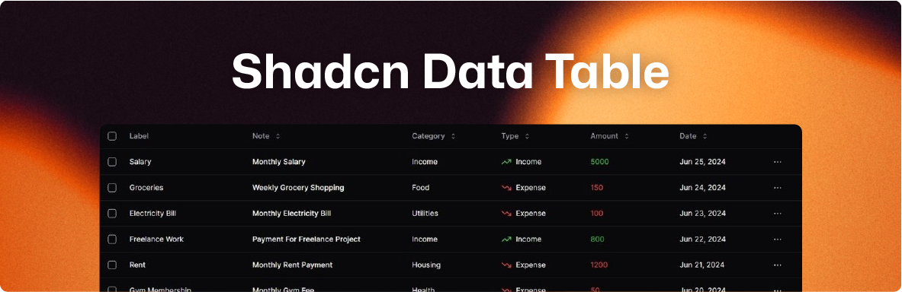

  

  

  
🗃️ Shadcn Data Table in React with sorting, filtering, pagination, and responsive design.

  🌐 English | [**Español**](./README-ES.md)

***

# Shadcn Data Table

**TASK LIST:**

- [x] Pagination with button navigation
- [x] Row selection with custom actions
- [x] Global search in the table
- [x] Search by specific columns
- [x] Column sorting
- [x] Filtering by multiple values
- [ ] Filtering by single value
- [ ] Filtering by day, month, or year
- [ ] Filtering by date range
- [x] Show or hide columns
- [ ] Export records to different formats
- [x] Highlight selected rows
- [ ] Fixed header on scroll
- [ ] Data loading skeleton
- [ ] Tabs for different tables
- [ ] Support for multiple languages
- [ ] Save and restore filters in LocalStorage
- [ ] Basic calculations by columns
- [ ] Integration with charts
- [ ] Documentation and usage examples
- [ ] Unit and integration tests
- [ ] Publish component on NPM
